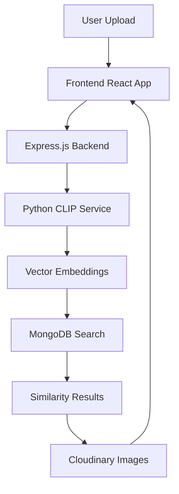
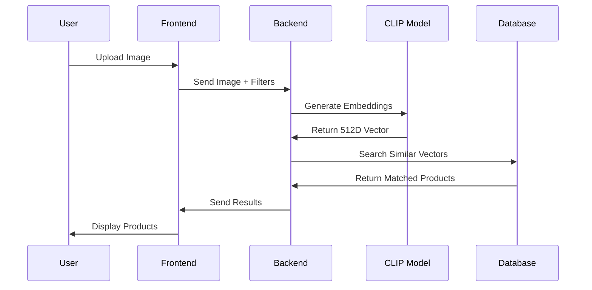

# 🎯 PixFind - AI-Powered Visual Product Search

<div align="center">

  
  
  
  
  
  
  
  

</div>

<div align="center">
  <h3>🔍 Find visually similar products using deep learning and CLIP embeddings</h3>
  <p>Upload an image and discover matching fashion items with AI-powered visual search</p>
  
  > *"Upload any product image and find visually similar items instantly"*
  
</div>

---

## 🎯 What is PixFind?

PixFind is an **AI-powered visual search engine** that revolutionizes how users discover products. By leveraging OpenAI's CLIP model, it understands images at a deep level and finds visually similar products with remarkable accuracy.

## ✨ Features

### 🌟 Core Capabilities

| Feature | Description |
|---------|-------------|
| 🖼️ **Visual Search** | Upload images or paste URLs to find similar products |
| 🎨 **AI Analysis** | CLIP model generates 512-dimensional embeddings |
| ⚡ **Real-time Results** | Lightning-fast similarity matching |
| 🎛️ **Smart Filters** | Gender, color, category, and similarity threshold |
| 🌙 **Dual Themes** | Beautiful dark/light mode with smooth transitions |
| 📱 **Responsive** | Perfect experience across all devices |

### 🎨 **Visual Search Engine**
- Upload images or paste URLs for instant similarity matching
- AI-powered analysis using CLIP (Contrastive Language-Image Pre-training)
- Real-time similarity scoring with percentage match

### 🎯 **Smart Filtering System**
- Filter by gender, color, category
- Adjustable similarity threshold (0-100%)
- Live filtering without page refresh

### 🌙 **Modern UI/UX**
- Beautiful dark/light theme toggle
- Fully responsive design for all devices
- Smooth animations with Framer Motion
- Clean, modern interface

### ⚡ **Performance Optimized**
- Cloudinary integration for fast image delivery
- MongoDB with indexed embeddings
- Efficient CLIP model processing
- Optimized search algorithms

## 🏗️ Architecture Overview



## 🛠️ Tech Stack

### 📚 Technology Stack

<table>
<tr>
<td align="center"><strong>Frontend</strong></td>
<td align="center"><strong>Backend</strong></td>
<td align="center"><strong>AI/ML</strong></td>
<td align="center"><strong>Database</strong></td>
</tr>
<tr>
<td>

- React 18
- Vite
- Tailwind CSS
- Framer Motion
- Lucide Icons

</td>
<td>

- Node.js
- Express.js
- Multer
- CORS
- dotenv

</td>
<td>

- CLIP (ViT-B/32)
- PyTorch
- Python 3.8+
- Vector Similarity
- Cosine Distance

</td>
<td>

- MongoDB
- Mongoose
- Cloudinary
- Vector Indexing
- Data Optimization

</td>
</tr>
</table>

### Frontend
- **React 18** - Modern UI library with hooks
- **Vite** - Fast build tool and dev server
- **Tailwind CSS** - Utility-first styling framework
- **Framer Motion** - Animation library
- **Lucide React** - Icon library

### Backend
- **Node.js** - JavaScript runtime
- **Express.js** - Web application framework
- **MongoDB** - NoSQL database
- **Mongoose** - MongoDB object modeling
- **Multer** - File upload handling
- **Cloudinary** - Image CDN and processing

### AI & Machine Learning
- **CLIP (ViT-B/32)** - Vision transformer model
- **PyTorch** - Deep learning framework
- **Python** - CLIP model execution
- **Vector Similarity** - Cosine similarity matching

### DevOps & Tools
- **Nodemon** - Development server
- **CORS** - Cross-origin resource sharing
- **dotenv** - Environment variable management
## 🚀 Quick Start

### 🔧 Prerequisites

✅ Node.js 18.0+  
✅ Python 3.8+  
✅ MongoDB 6.0+  
✅ Git  
✅ Cloudinary Account (Free tier works)

### ⚡ Installation

#### 1️⃣ **Clone & Navigate**
```bash
git clone https://github.com/saloni-st/pixfind.git
cd pixfind
```

#### 2️⃣ **Python Dependencies**
```bash
cd backend/utils
pip install torch torchvision clip-by-openai pillow requests numpy
```

#### 3️⃣ **Node.js Dependencies**
```bash
# Install backend dependencies
cd ../
npm install

# Install frontend dependencies
cd ../frontend
npm install
```

#### 4️⃣ **Environment Setup**

Create `backend/.env`:
```env
# Database
MONGO_URI=mongodb://localhost:27017/pixfind

# Cloudinary Configuration
CLOUDINARY_CLOUD_NAME=your_cloud_name
CLOUDINARY_API_KEY=your_api_key
CLOUDINARY_API_SECRET=your_api_secret

# Server Configuration
PORT=5000
FRONTEND_URL=http://localhost:5173
FRONTEND_PROD_URL=https://your-domain.com
```

Create `frontend/.env`:
```env
VITE_BACKEND_URL=http://localhost:5000
```

#### 5️⃣ **Database Initialization**
```bash
cd backend
node utils/seedProducts.js
```

#### 6️⃣ **Launch Application**
```bash
# Terminal 1: Start Backend
cd backend && npm run dev

# Terminal 2: Start Frontend
cd frontend && npm run dev
```

#### 7️⃣ **Access Application**
- 🌐 **Frontend**: http://localhost:5173
- 🔧 **Backend**: http://localhost:5000

---

## 💡 How It Works

<div align="center">



</div>

### 🔄 Processing Pipeline

1. **Image Upload** → User uploads image or provides URL
2. **Preprocessing** → Image optimization via Cloudinary
3. **Embedding** → CLIP model generates vector representation
4. **Similarity Search** → Cosine similarity calculation
5. **Filtering** → Apply user-defined filters
6. **Results** → Return ranked similar products

## 🎨 UI Features

### 🌓 Theme System
- **Dark Theme**: Modern, sleek interface with high contrast
- **Light Theme**: Clean, minimal design with soft colors
- **Auto-Toggle**: Smooth animations between themes
- **Persistent**: Remembers user preference

### 📱 Responsive Design
| Device | Breakpoint | Optimization |
|--------|------------|-------------|
| 📱 Mobile | < 640px | Touch-friendly, compact layout |
| 🖥️ Tablet | 640px - 1024px | Balanced grid, readable text |
| 💻 Desktop | > 1024px | Full feature set, larger images |

---

## 🔧 API Documentation

### 🔍 Search Endpoint

**POST** `/api/products/search`

```javascript
// Request
{
  "file": <FormData>, // Optional: Image file
  "imageUrl": "https://example.com/image.jpg", // Optional: Image URL
  "filters": {
    "gender": "Men" | "Women" | "Unisex",
    "baseColour": "Black" | "White" | "Blue" | ...,
    "category": "Footwear" | "Apparel" | "Accessories",
    "similarity": 0-100 // Minimum similarity percentage
  }
}

// Response
[
  {
    "_id": "64a1b2c3d4e5f6789012345",
    "productDisplayName": "Classic Black Sneakers",
    "gender": "Men",
    "baseColour": "Black",
    "masterCategory": "Footwear",
    "imageUrl": "https://res.cloudinary.com/...",
    "similarity": 0.89 // Similarity score (0-1)
  }
]
```

### 📊 Response Codes
- `200` - Success
- `400` - Invalid request/missing image
- `500` - Server error/CLIP processing failed

## � Features Deep Dive

### AI-Powered Search
- Uses OpenAI's CLIP model for understanding images
- Generates high-quality 512-dimensional embeddings
- Performs fast cosine similarity calculations
- Supports both uploaded files and image URLs

### Smart Filtering
- Real-time filtering without API calls
- Multiple filter combinations
- Similarity threshold adjustment
- Instant results update

### Image Processing
- Automatic image optimization via Cloudinary
- Support for multiple image formats
- Error handling for invalid images
- Progressive image loading

## 🚀 Performance

- **Search Speed**: < 500ms average
- **Image Processing**: 1-3s for embedding generation
- **Database Queries**: Optimized with indexes
- **UI Responsiveness**: 60fps animations
- **Bundle Size**: Optimized for fast loading

## 🎯 Future Enhancements

- [ ] **Multi-modal Search**: Text + Image queries
- [ ] **User Accounts**: Save favorites and search history
- [ ] **Advanced Filters**: Brand, price range, ratings
- [ ] **Recommendation Engine**: Personalized suggestions
- [ ] **Mobile App**: React Native implementation
- [ ] **Multi-language Support**: Internationalization

## 📁 Project Structure

```
pixfind/
├── 📂 frontend/                    # React application
│   ├── 📂 src/
│   │   ├── 📂 components/         # Reusable UI components
│   │   │   ├── Navbar.jsx         # Navigation with theme toggle
│   │   │   ├── SearchSection.jsx  # Upload and search interface
│   │   │   ├── FilterPanel.jsx    # Product filtering options
│   │   │   ├── ResultCard.jsx     # Product display card
│   │   │   └── ProductCard.jsx    # Alternative product view
│   │   ├── 📂 utils/
│   │   │   └── cloudinary.js      # Image optimization utilities
│   │   ├── App.jsx                # Main application component
│   │   ├── main.jsx               # Application entry point
│   │   └── index.css              # Global styles and themes
│   ├── 📄 package.json            # Frontend dependencies
│   └── 📄 vite.config.js          # Vite configuration
├── 📂 backend/                     # Node.js server
│   ├── 📂 controllers/
│   │   └── productsController.js  # Search logic and API handlers
│   ├── 📂 models/
│   │   └── Product.js             # MongoDB product schema
│   ├── 📂 routes/
│   │   └── products.js            # API route definitions
│   ├── 📂 config/
│   │   └── db.js                  # Database connection
│   ├── 📂 utils/
│   │   ├── embeddingsPy.js        # Python CLIP integration
│   │   ├── generate_embed.py      # CLIP embedding script
│   │   └── seedProducts.js        # Database seeding
│   ├── 📄 index.js                # Server entry point
│   └── 📄 package.json            # Backend dependencies
├── 📂 data/                        # Dataset and utilities
│   ├── 📂 raw/                    # Original CSV data
│   └── uploadCloudinary.js        # Data upload script
└── 📄 README.md                   # Project documentation
```

## 🤝 Contributing

We welcome contributions from the community! Here's how you can help:

### 🎯 Ways to Contribute
- 🐛 **Bug Reports**: Found an issue? Let us know!
- ✨ **Feature Requests**: Have an idea? We'd love to hear it!
- 📝 **Documentation**: Help improve our docs
- 🔧 **Code**: Submit pull requests for fixes and features

### 📋 Development Process
```bash
1. Fork the repository
2. Create feature branch: git checkout -b feature/amazing-feature
3. Make your changes
4. Test thoroughly
5. Commit: git commit -m 'Add amazing feature'
6. Push: git push origin feature/amazing-feature
7. Open a Pull Request
```

### 🧪 Testing Guidelines
- Write unit tests for new features
- Ensure all existing tests pass
- Test across different browsers and devices
- Verify mobile responsiveness

## 📜 License

This project is licensed under the **MIT License** - see the [LICENSE](LICENSE) file for details.

```
MIT License - Feel free to use this project for personal and commercial purposes
```

## 🙏 Acknowledgments

<div align="center">

### 💎 Special Thanks

| Technology | Contribution |
|------------|-------------|
| 🤖 **OpenAI CLIP** | Revolutionary vision-language model |
| ☁️ **Cloudinary** | Powerful image optimization platform |
| 🍃 **MongoDB** | Flexible and scalable database solution |
| ⚛️ **React Team** | Amazing frontend framework |
| 🎨 **Tailwind CSS** | Beautiful utility-first styling |

### 🌟 Community

Thanks to all the contributors who have helped make PixFind better!

</div>